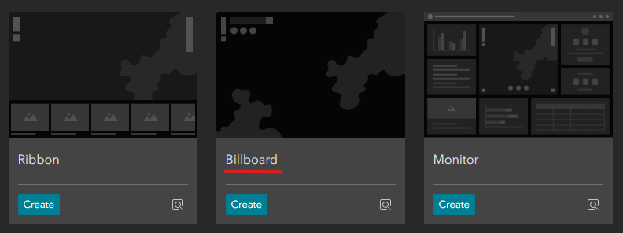
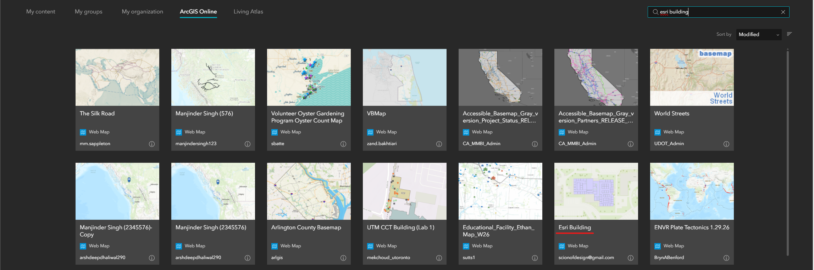
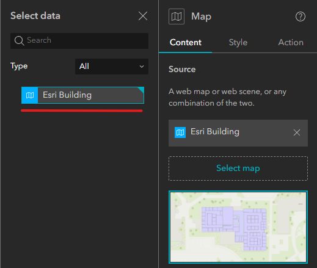
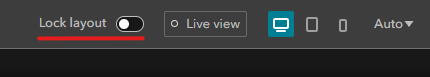
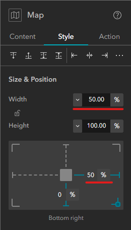
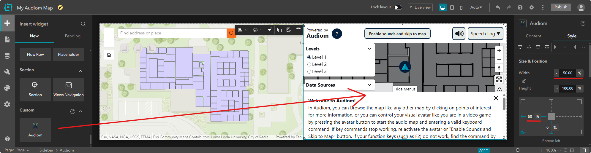

# Setting Up the Audiom Widget in ArcGIS Experience Builder

This tutorial walks you through adding the Audiom widget to an ArcGIS Experience Builder project using the Esri Building sample map.

## Prerequisites

- Access to ArcGIS Experience Builder
- The Audiom widget installed (see [installation instructions](../index.md#-installing-the-audiom-widget))
- An Audiom API key

---

## Step 1: Create a New Project

Open ArcGIS Experience Builder and create a new project. In the template selection screen, choose the **Billboard** template, which provides a full-page layout ideal for map displays.

---

## Step 2: Add the Esri Building Web Map

With your new project open, click on the map component in the canvas or select it from the **Page** hierarchy panel on the left. In the **Content** settings panel on the right:

1. Click **Select map**
2. At the bottom of the "Select data" window, click **Add new data**
3. Search for "Esri Building" in ArcGIS Online
4. Select the Esri Building web map from the search results

---

## Step 3: Select the Map Data Source

After adding the Esri Building map, it will appear in your available data sources. In the **Select data** panel, click on the **Esri Building** option to assign it to your map widget.

---

## Step 4: Unlock the Layout

Before repositioning widgets, you need to unlock the layout. In the header bar at the top of Experience Builder, locate the **Lock layout** toggle and turn it **off**. This allows you to resize and reposition widgets freely.

---

## Step 5: Resize the Esri Map Widget

With the Esri map selected, open its **Style** settings panel. Adjust the following properties to make room for the Audiom widget:

- Set **Width** to **50%**
- Set the **From right** margin to **50%**

This positions the Esri map on the left half of the screen.

---

## Step 6: Add the Audiom Widget

Switch to the **Insert** view using the tab at the top of the left panel. Scroll down through the widget list to find the **Audiom** widget. You can either:

- Drag and drop the widget onto the canvas, or
- Select it and press **Enter** to add it

Once added, click on the Audiom widget in the canvas or select it from the **Page** hierarchy. In its **Style** settings:

- Set **Width** to **50%**
- Set the **From left** margin to **50%**

This positions the Audiom widget on the right half of the screen, adjacent to the Esri map.

---

## Step 7: Configure the Audiom Widget

Click on the Audiom widget and open its **Content** settings panel. You'll notice that the widget has automatically synced with the Esri map:

- The initial view settings (center coordinates, zoom level) are populated
- All individual map layers from the Esri Building map are listed

To complete the configuration:

1. Enter your **API Key** in the designated field
2. Under **Source Configurations**, locate the **Rules File (All)** setting
3. Set it to `/rules/esri-indoor.json` to enable proper object labeling for indoor maps

---

## Next Steps

After completing these steps, your Experience Builder project will have a synchronized Audiom widget that provides accessible audio navigation and descriptions of map features. You can:

- Publish your experience to share it with others
- Customize additional Audiom settings as needed
- Integrate Audiom seamlessly into your existing maps

For more information on embedding Audiom in using the built-in Embed widget, see the [embedding documentation](../embedding.md).
